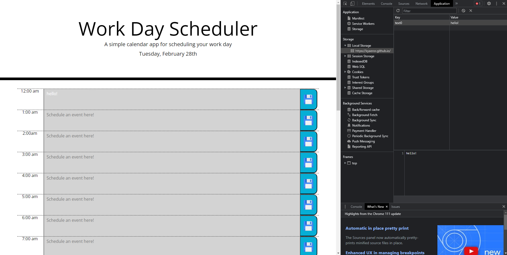

# Scheduler

## Description
### This is a scheduler that saves your events when you click the button to the right and display the data even when you refresh. If it's a new day then it will delete the data. The time is color coded based on the past present or future. 

## Screenshot

## Deployed Application Link
### https://kyaeror.github.io/Scheduler/